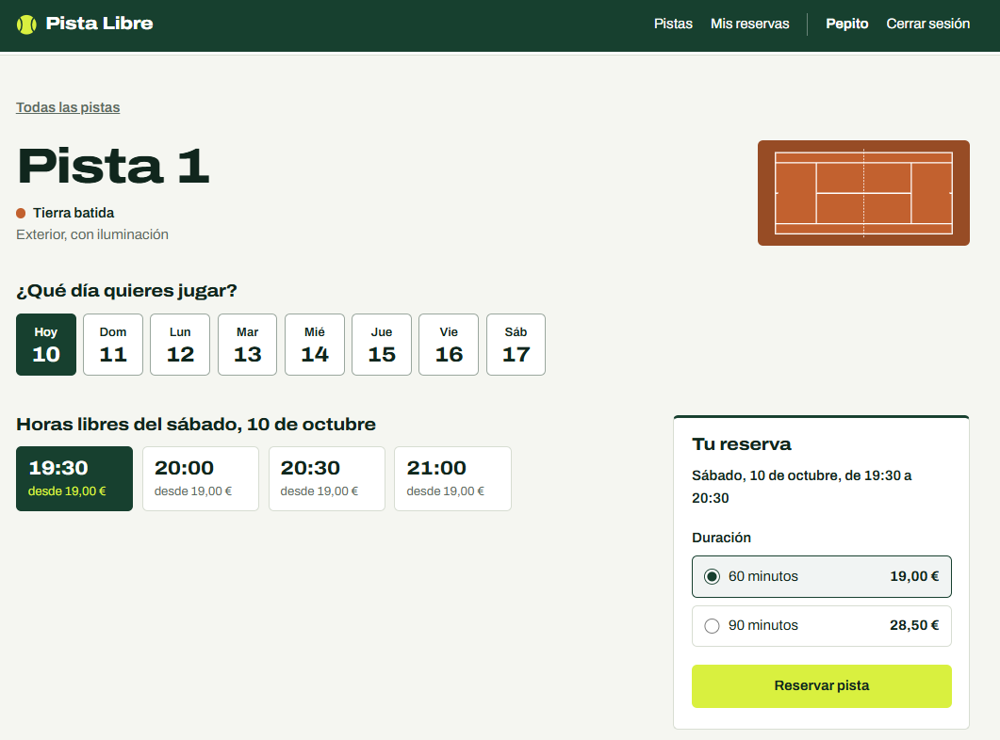
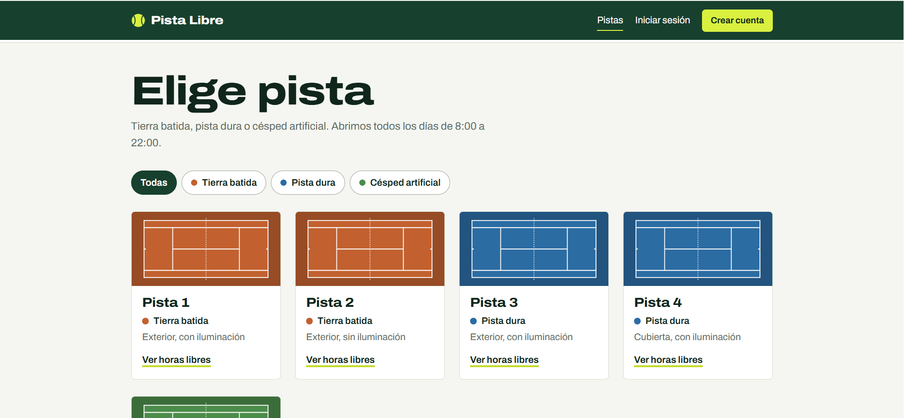
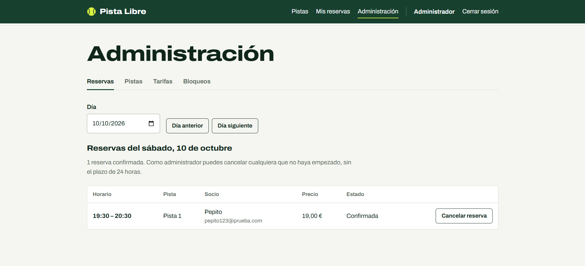
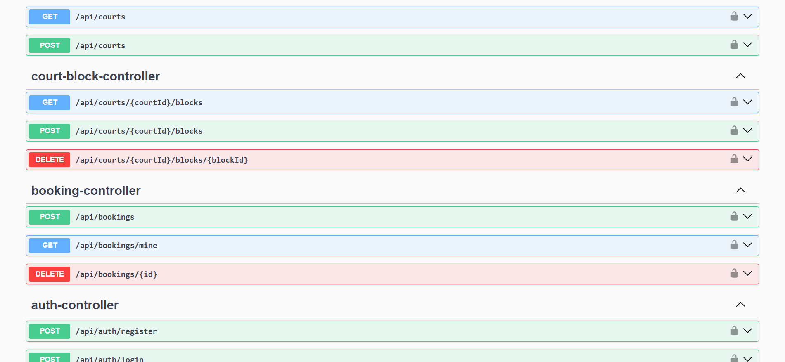

# Pista Libre

Aplicación web para gestionar las reservas de un club de tenis: los socios consultan las horas libres de cada pista y reservan, y el club administra pistas, tarifas, bloqueos y reservas desde un panel.

Back en **Java y Spring Boot** con **PostgreSQL**, y front en **Angular**.



| Portada | Panel de administración |
|---|---|
|  |  |

## Stack

**Back**

- **Java 21** y **Spring Boot 4**
- **PostgreSQL 17**, con migraciones gestionadas por **Flyway**
- **Spring Data JPA** (Hibernate)
- **Spring Security** con autenticación **JWT** y control de acceso por roles
- **Testcontainers** y **JUnit** para tests de integración contra una base de datos real
- **springdoc-openapi** (Swagger UI) para la documentación
- **Docker Compose** para el entorno local

**Front**

- **Angular 21** con componentes *standalone* y **signals**
- **TypeScript** y **SCSS**, sin librerías de componentes
- **RxJS** para las llamadas a la API
- Formularios reactivos

## Funcionalidades

**Para el socio**

- **Registro e inicio de sesión.** La sesión se mantiene al recargar y se cierra sola cuando caduca el token.
- **Pistas.** Tierra batida, pista dura o césped artificial; cubiertas o exteriores; con o sin iluminación. Se pueden filtrar por superficie.
- **Horas libres.** Disponibilidad de cada pista para hoy y los siete días siguientes, con el precio de cada opción.
- **Reservas.** Tramos de 60 o 90 minutos, con antelación máxima, límite de reservas activas y plazo de cancelación.
- **Mis reservas.** Próximas y anteriores, con cancelación.

**Para el administrador**

- **Reservas del día.** Todas las reservas de cualquier socio, con posibilidad de cancelarlas.
- **Pistas.** Alta, edición, desactivación y reactivación.
- **Tarifas.** Precio por hora según superficie, tipo de día (laborable o fin de semana) y franja (valle o punta), más un suplemento por iluminación.
- **Bloqueos.** Cierre de una pista durante un intervalo por mantenimiento, lluvia o torneos.

## Decisiones técnicas

### Back

**Dobles reservas imposibles, también con concurrencia.** Al reservar se bloquea la fila de la pista (`SELECT ... FOR UPDATE`), de modo que las peticiones simultáneas sobre una misma pista se procesan de una en una. Como última línea de defensa, una restricción de exclusión de PostgreSQL (`EXCLUDE USING gist` sobre la pista y el rango horario) rechaza cualquier solapamiento aunque se escriba en la tabla por otra vía. Un test lanza diez reservas idénticas a la vez y comprueba que solo una se confirma.

**Tests contra PostgreSQL real.** Los tests de integración usan Testcontainers en lugar de una base de datos en memoria, porque la restricción de exclusión y el bloqueo de filas son específicos de PostgreSQL y con H2 no se estarían probando.

**El esquema lo controla Flyway.** Hibernate arranca en modo `validate`: no crea ni modifica tablas, solo comprueba que las entidades coinciden con las migraciones versionadas.

**Fechas en UTC.** Las reservas se guardan como instantes y se convierten a la zona horaria del club al entrar y salir de la API, lo que evita errores con el cambio de hora.

**Precio calculado por tramos y guardado en la reserva.** El importe se calcula en tramos de media hora, porque una reserva puede cruzar de tarifa valle a punta o entrar en horario con luz. Se almacena con la reserva para que un cambio posterior de tarifas no altere lo ya reservado.

**Errores en formato estándar.** Todas las respuestas de error siguen el formato *Problem Details* (RFC 9457), con el detalle por campo en los errores de validación.

**Borrado lógico.** Las pistas se desactivan y las reservas se cancelan, pero no se eliminan, para conservar el historial.

**JWT con el soporte nativo de Spring Security.** La validación del token usa el *resource server* de Spring Security en lugar de un filtro escrito a mano.

### Front

**Estado con signals.** La sesión y el estado de cada pantalla se guardan en signals, sin librería de estado externa.

**Interceptor HTTP para la sesión.** Añade el token a cada llamada a la API y, si la API responde 401, cierra la sesión y lleva al login.

**Rutas protegidas por rol.** Los *guards* impiden entrar al panel sin ser administrador y, tras iniciar sesión, devuelven al usuario a la página desde la que venía.

**Sin respuestas desfasadas.** Al cambiar de día rápidamente, `switchMap` descarta la respuesta de la petición anterior, de modo que nunca se muestran horas de un día que ya no está seleccionado.

**La hora del club, no la del navegador.** "Hoy" y "ahora" se calculan en la zona horaria del club, para que coincidan con la API aunque el usuario esté en otro huso.

**Los errores de la API llegan al usuario.** Los mensajes de *Problem Details* se muestran tal cual, incluidos los errores por campo en los formularios.

## Cómo arrancarlo en local

Requisitos: **Java 21 o superior**, **Docker** y **Node.js 20 o superior**.

**1. Back**

```bash
cd backend
docker compose up -d      # levanta PostgreSQL
./mvnw spring-boot:run    # Flyway crea las tablas y los datos de ejemplo
```

**2. Front**, en otra terminal:

```bash
cd frontend
npm install
npm start
```

La aplicación queda en <http://localhost:4200> y la documentación de la API en <http://localhost:8081/swagger-ui.html>. El servidor de desarrollo de Angular redirige las llamadas a `/api` hacia el back.

Al arrancar se crea un usuario administrador de desarrollo:

| Email | Contraseña |
|---|---|
| `admin@courtbooking.local` | `admin1234` |

### Tests

```bash
cd backend
./mvnw test
```

Necesitan Docker en marcha, porque Testcontainers levanta un PostgreSQL desechable para la ejecución.

## API



| Método | Ruta | Descripción | Acceso |
|---|---|---|---|
| POST | `/api/auth/register` | Registro de un socio | Público |
| POST | `/api/auth/login` | Inicio de sesión | Público |
| GET | `/api/auth/me` | Datos del usuario autenticado | Autenticado |
| GET | `/api/courts` | Pistas activas, con filtro por superficie | Público |
| GET | `/api/courts/{id}` | Detalle de una pista | Público |
| POST | `/api/courts` | Alta de una pista | Admin |
| PUT | `/api/courts/{id}` | Edición de una pista | Admin |
| DELETE | `/api/courts/{id}` | Desactivación de una pista | Admin |
| PUT | `/api/courts/{id}/activate` | Reactivación de una pista | Admin |
| GET | `/api/courts/{id}/availability?date=` | Horas libres y precios de un día | Público |
| GET | `/api/courts/{id}/blocks?date=` | Bloqueos de un día | Público |
| POST | `/api/courts/{id}/blocks` | Alta de un bloqueo | Admin |
| DELETE | `/api/courts/{id}/blocks/{blockId}` | Baja de un bloqueo | Admin |
| POST | `/api/bookings` | Nueva reserva | Autenticado |
| GET | `/api/bookings/mine` | Reservas del usuario | Autenticado |
| DELETE | `/api/bookings/{id}` | Cancelación de una reserva | Dueño o admin |
| GET | `/api/price-rules` | Listado de tarifas | Público |
| PUT | `/api/price-rules/{id}` | Cambio de precio de una tarifa | Admin |
| GET | `/api/admin/courts` | Todas las pistas, incluidas las desactivadas | Admin |
| GET | `/api/admin/bookings?date=` | Reservas de todos los socios en un día | Admin |

## Configuración

Las reglas de negocio (horario del club, antelación máxima, límite de reservas, plazo de cancelación, horario y suplemento de iluminación) están en `backend/src/main/resources/application.yml`, bajo `app.booking`.

Los valores sensibles tienen un valor por defecto solo para desarrollo y se sustituyen con variables de entorno en cualquier otro entorno:

| Variable | Descripción |
|---|---|
| `JWT_SECRET` | Clave de firma de los tokens (mínimo 32 caracteres) |
| `ADMIN_PASSWORD` | Contraseña del administrador inicial |

## Estructura

```
├── backend     API REST (Spring Boot)
├── frontend    Aplicación web (Angular)
└── docs        Capturas
```

Tanto el back como el front están organizados por funcionalidad, no por capa técnica.

```
backend · com.juancala.courtbooking
├── auth       Registro e inicio de sesión
├── user       Usuarios y roles
├── court      Pistas
├── booking    Reservas, reglas de negocio y disponibilidad
├── pricing    Tarifas y cálculo de precios
├── block      Bloqueos de pista
├── security   Configuración de seguridad y JWT
├── config     Configuración de OpenAPI
└── common     Excepciones y gestión de errores
```

```
frontend · src/app
├── core       Sesión, interceptor, guards, modelos y utilidades
└── features
    ├── auth       Inicio de sesión y registro
    ├── courts     Listado de pistas y página de reserva
    ├── bookings   Mis reservas
    └── admin      Panel de administración
```

## Próximos pasos

- Disponibilidad actualizada en vivo con WebSockets.
- Email de confirmación al reservar.
- Tests del front.
- Integración continua con GitHub Actions y despliegue de una demo pública.

## Autor

**Juan Cala Cuesta** · [GitHub](https://github.com/kla7712) · [Portfolio](https://kla7712.github.io/)
